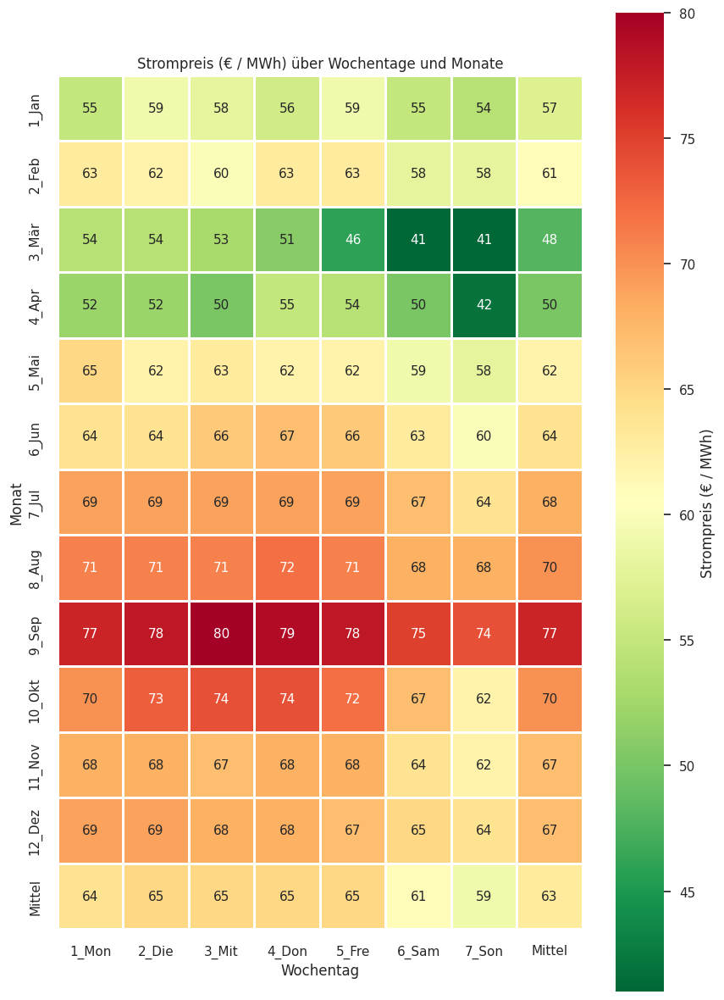
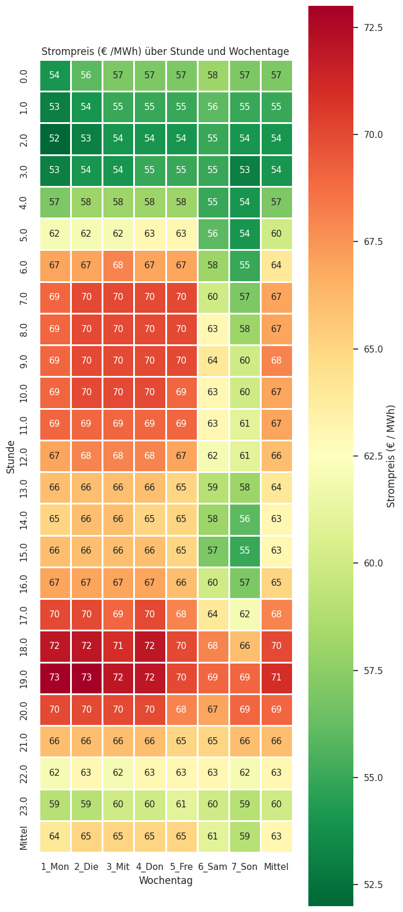
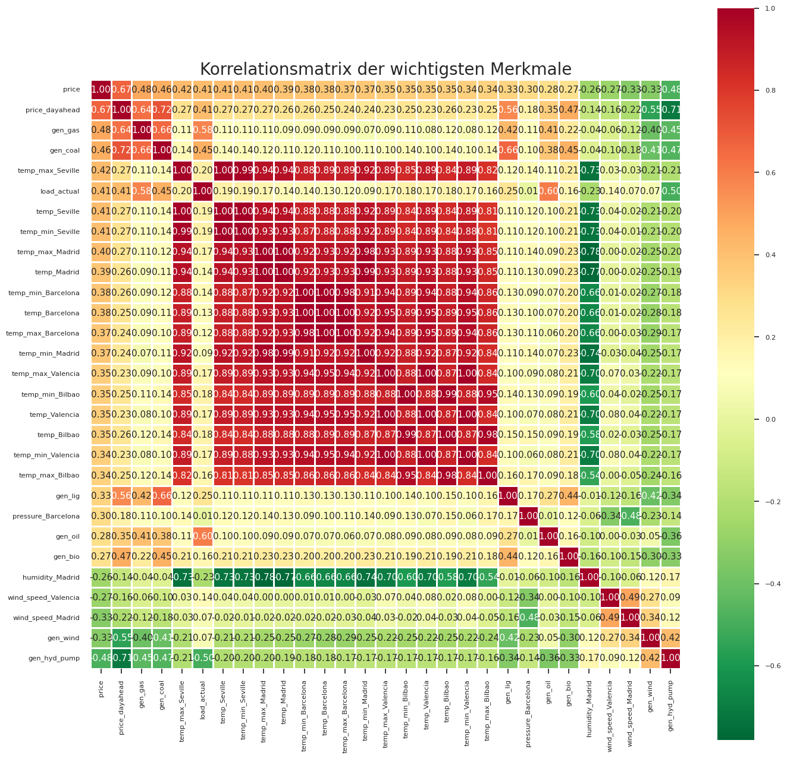
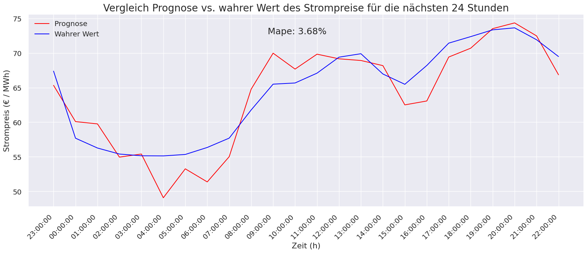
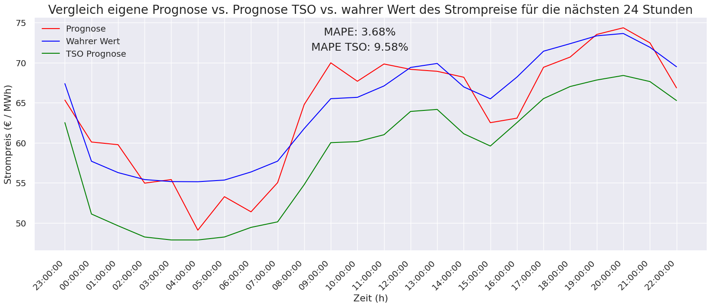

# Use-case: Forecasts for the Spanish energy transition

## 1. Scenario:
In the course of the energy transition, a Spanish TSO asks for your help. Volatile, decentralized generators, increasingly complex electricity markets and higher political requirements are putting the TSO under more and more pressure. In order to optimize expansion planning, the TSO initially tried out various forecasts itself.

The TSO is now asking you, as an independent body, to also prepare a forecast to verify your own or to generate better alternatives

## Get the detailed analysis of the data and forecasts here:
[Full presentation](Analyse_Energy_prices_Spain_results.pdf)

## 2. Influencing factors on the electricity prices

### Analyse Trends and Seasonality

#### Heatmap: Daily vs. Monthly electricity prices

#### Heatmap: Hourly vs. Daily electricity prices

### Correlation analysis

#### Figure: Show correlations between most important features 

## 3. Time series forecast

- Comparison of different ML models with cross-validation and AutoML (criteria: **MAPE** )
- ChooseEBM (ML-Model) –Explainable BoostingMachine (Regressor)

### Comparison forecast vs. ground truth next 24 hours

### Comparison forecast vs. ground truth vs. TSO forecast next 24 hours

## 4. Conclusion and outlook

- **Conclusion** :
    - Influencing factors identified and explained (see chapter 2)
    - Forecast created with very low error (3.5%) for the next 24 hours
    - Recommendation for transmission system operators → Own forecast is significantly more accurate
- **Next steps** :
    - Forecast various weather data and producers for more accurate forecasts and out-of-sample forecasts
    - Detailed analysis of additional features in order to identify further trends and derive new features from
       them
    - Data set sufficiently large for an approach with artificial neural networks
       - But training computationally and time consuming

